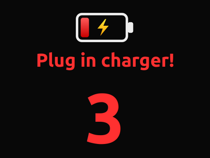

# XFCETweaks

Make XFCE feel finished. Clean on-screen feedback for every hardware key,
audio that goes where you expect, screenshots that catch open menus, and a
laptop that won't die in the middle of your work.

Built for Linux Mint 22 / XFCE 4.18 on X11. One command to install.

## Highlights

| | Feature | What you get |
|---|---|---|
|  | [Brightness](#brightness) | 20 smooth steps, fine control in the dark |
|  | [Volume](#volume) | Instant response, boost up to 200% |
|  | [Microphone](#microphone) | One key to mute, clear on-screen status |
|  | [Screenshots](#screenshots) | Freeze the screen, crop, done: menus included |
|  | [Charger alerts](#charger-alerts) | Instant plug/unplug badge with exact charge |
|  | [Low-battery rescue](#low-battery-rescue) | Full-screen warning, media paused, safe hibernate |
|  | [Headphone auto-switch](#headphone-auto-switch) | Sound follows your headset, never blasts the speakers |
|  | [Mic quality guard](#mic-quality-guard) | Consistent, clean voice in every call |
| | [Realtime audio](#realtime-audio) | No crackles when the machine is busy |
| | [Fullscreen zoom](#fullscreen-zoom) | Super+plus / Super+minus magnifier |
| | [GPU control](#gpu-control) | Save battery or hand the NVIDIA GPU to a VM |
| | [Hibernate](#hibernate) | Checked, one-command hibernation |
| | [Smart charge](#smart-charge) | Longer battery life when plugged in all day |
| | [Show desktop](#show-desktop) | Works with every window, Wine apps included |
| | [Icon theme guard](#icon-theme-guard) | Start menu and app icons never go missing |
| | [Terminal fonts](#terminal-fonts) | Spinners and symbols render, no empty boxes |

## On-screen displays

### Brightness


Twenty evenly spaced steps that look even to the eye: tiny adjustments at
night, quick jumps in daylight. The display shows the step (`12/20`)
instead of a misleading hardware percentage.

<details>
<summary>How it works</summary>

`sbin/brightness-step` handles `XF86MonBrightnessUp/Down` with stops tuned
for the panel (`1 2 3 5 8 13 21 34 47 70 101 142 193 253 324 403 492 589
693 800` at max 800): exponential at the dark end, close to linear at the
top. Panels with a different maximum are scaled automatically.

</details>

### Volume


Volume keys react immediately, even when held down, with a badge showing
the exact level. Need more? Go past 100% up to 200%.

<details>
<summary>How it works</summary>

`bin/xfce-pipewire-volume` makes one `wpctl` call per key press, so key
repeat never lags. The badge combines the icon, exact percent and a bar
with an overdrive section.

</details>

### Microphone


One key mutes or unmutes your microphone, and a clear badge tells you
which state you're in.

<details>
<summary>How it works</summary>

`bin/mic-toggle` flips the default source's mute and shows the matching
notification.

</details>

## Screenshots


Press `Print` and the screen freezes, so right-click menus and tooltips
stay exactly where they were. Drag to crop, and the image is on your
clipboard.

| Shortcut | Captures |
| --- | --- |
| `Print` | A region you select |
| `Shift+Print` | The whole screen |
| `Alt+Print` | The active window |
| `Ctrl+Print` | A region after 5 seconds, so you can open a menu first |

<details>
<summary>How it works</summary>

`bin/rect-screenshot-clipboard` captures the screen in-process through GDK
(falling back to ImageMagick `import`), then `libexec/screenshot-cropper`
crops on the frozen image while grabbing keyboard and pointer, so no app
reacts to the key press. A second `Print` while cropping is ignored. The
result stays on the clipboard through a small GTK owner process. The
delay for `Ctrl+Print` is set with `$SCREENSHOT_MENU_DELAY`.

Firefox closes its own context menus the moment `Print` is pressed,
before any screenshot tool can run. For Firefox menus use `Ctrl+Print`,
reopen the menu during the delay, then select the area.

</details>

## Battery and power

### Charger alerts


Plug in or unplug and a badge with the exact charge appears within about
a second. A loose jack flickering on and off won't spam you.

<details>
<summary>How it works</summary>

`charger-watch.service` (`bin/charger-watch`) listens to kernel
`power_supply` events and runs `bin/battery-guard` right away, with a 30 s
timer as a safety net. The charger's `online` flag is the source of
truth, not the battery status, which also changes for "Full" or
conservation mode. A 1 s re-check filters out flapping. Badges are drawn
by `bin/osd-badge` and cached per percent.

</details>

### Low-battery rescue


At 18% on battery, a full-screen countdown asks you to plug in. Your music
and videos pause so you hear the warning. Plug in and everything resumes
where it was; don't, and the laptop hibernates safely instead of dying.

<details>
<summary>How it works</summary>

`sbin/battery-shutdown-countdown` runs as
`battery-hibernate-countdown.service`, started by `battery-guard`. It
reacts to UPower signals and kernel events, so plugging in dismisses it
instantly even when UPower lags. It pauses MPRIS players (Firefox,
Spotify, …) over D-Bus and resumes only the ones it paused, and only when
the charger comes back. It falls back to suspend when hibernation isn't
available. Try it safely with
`BATTERY_COUNTDOWN_SECONDS=3 battery-shutdown-countdown --test`.

</details>

### Hibernate

Save everything to disk and power off, with checks up front so it doesn't
fail halfway.

```sh
sudo hibernate-setup --kernel   # one-time setup
# reboot, then:
hibernate --check && hibernate
```

<details>
<summary>How it works</summary>

`bin/hibernate` checks swap size, the `resume=` kernel parameter, kernel
support, Secure Boot and NVIDIA video-memory preservation before
hibernating. `sbin/hibernate-setup` does the one-time work: latest HWE
kernel, a btrfs-safe swapfile, GRUB `resume=UUID` / `resume_offset=`,
initramfs, NVIDIA power options (`modprobe/`) and the systemd sleep policy
(`sleep.conf.d/`).

</details>

### GPU control

Keep the NVIDIA GPU asleep for longer battery life, pin a single app to
it, or hand it to a virtual machine.

| Command | Result |
| --- | --- |
| `gpu off` / `gpu auto` | GPU sleeps when idle, new apps use the Intel GPU |
| `gpu host` | GPU always on, for host apps only |
| `gpu on` | GPU on for the host, VMs keep their virtual display |
| `gpu vm` | Full GPU passthrough to the `tiny10` VM |
| `gpu run --dgpu -- <cmd>` | Launch one app on a chosen GPU (`--igpu` too) |
| `gpu status` | Current mode, power state, power draw, apps using it |

<details>
<summary>How it works</summary>

`bin/gpu` and `sbin/gpu-power` manage the RTX 5070 Laptop GPU. No mode
kills running apps or moves live GL/Vulkan/CUDA work; `gpu vm` refuses
while Xorg or anything else uses the GPU.

- **Passthrough (`gpu vm`)** gives the GPU and its HDMI audio exclusively
  to the stopped `tiny10` libvirt VM. Switch from a text console or SSH
  with `lightdm` stopped. When done, shut down the VM, run `gpu host`,
  then start `lightdm`.
- **Virtual display** VMs can keep running while you switch between
  `gpu host`, `gpu on` and `gpu off`. Linux VMs can share host 3D through
  VirtIO-GPU/VirGL; Tiny10's Windows driver lacks stable VirGL, so its
  display is 2D.
- **`tiny10`** is a UEFI libvirt VM with 8 GiB RAM, 8 vCPUs and a 96 GiB
  sparse disk. Start it from `virt-manager` or with
  `sudo virsh -c qemu:///system start tiny10`.

</details>

### Smart charge

Plugged in all day? Cap charging to protect the battery.
`smart-charge on | off | toggle | status` switches Lenovo conservation
mode.

## Audio

### Headphone auto-switch


Connect your headset and all sound moves to it, including what's already
playing. Nothing leaks through the speakers while it switches, and a
brief Bluetooth hiccup doesn't send your call to the room.

<details>
<summary>How it works</summary>

`bin/audio-output-autoswitch` (`audio-output-autoswitch.service`) follows
`pactl subscribe` events. It sets the new default through WirePlumber
before moving existing streams, so new sounds can't slip out of the
speakers, and it ignores the short sink drop during Bluetooth codec
renegotiation. Wired headphones work through the ALSA fallback.

Set your Bluetooth headset in `~/.config/XFCETweaks/audio.conf`
(`HEADSET_ADDRESS`, `HEADSET_TOKEN`; see `config/audio.conf.example`).
With empty values, only wired switching is active.

</details>

### Mic quality guard

Your voice sounds the same in every call: levels stay fixed, and apps
record through a clean voice filter.

<details>
<summary>How it works</summary>

`bin/mic-quality-setup` (`mic-quality.service --watch`) turns boosts off,
holds capture at 50%, feeds the `voice_clear` filter from the real
microphone only, and routes app recordings to it.

</details>

### Realtime audio

No crackles or dropouts when compiling, gaming or running VMs.

<details>
<summary>How it works</summary>

`bin/pipewire-rt-guard` (`pipewire-rt-guard.service`) and the drop-ins in
`systemd/user/{pipewire,pipewire-pulse,wireplumber}.service.d/` give
PipeWire's audio threads realtime priority.

</details>

## Desktop

### Fullscreen zoom

Hold Super and press plus or minus (`=`, `-`, or the numpad keys) to zoom
the whole screen around the pointer.

<details>
<summary>How it works</summary>

`bin/xfwm-fullscreen-zoom` drives the xfwm4 compositor zoom, which only
reacts to scroll clicks with its `easy_click` modifier (Alt by default)
held. The helper briefly swaps Super for that modifier, sends the clicks,
waits for xfwm4 to take each one, and puts Super back, without triggering
an xcape Super-tap. A press takes about 100 ms. `ZOOM_STEPS` (default 3)
sets how far each press zooms.

</details>

### Show desktop

`Super+D` minimizes every window and brings them all back, including Wine
apps like Mailbird that ignore XFCE's built-in version.

<details>
<summary>How it works</summary>

`bin/toggle-desktop` minimizes and restores window by window instead of
using the EWMH show-desktop request, which Wine ignores and xfwm4 cancels
as soon as a window is touched.

</details>

### Icon theme guard

Start menu and app icons stay put, even after installers or Wine drop
icons into your home folder.

<details>
<summary>How it works</summary>

GTK takes the `hicolor` directory list from the first `index.theme` it
finds, and a minimal copy in `~/.local/share/icons/hicolor/` hides every
system directory it leaves out (such as the Mint start-menu icon).
`bin/hicolor-index-sync` rewrites the user copy as the system one plus
any user-only directories, then rebuilds the icon cache. It runs at login
(`hicolor-index-sync.service`) and whenever either file changes
(`hicolor-index-sync.path`).

</details>

### Terminal fonts

Braille spinners and geometric symbols, like the ones opencode uses,
render in the terminal instead of empty boxes.

<details>
<summary>How it works</summary>

`install.sh` installs Symbola, Noto Extra and JetBrains Mono, adds
`config/fontconfig/10-xfcetweaks-terminal-fallback.conf` (monospace →
JetBrains Mono, then Symbola / Noto Sans Symbols2 / DejaVu Sans), and
seeds `~/.config/ghostty/config` with the same fallbacks if you don't
have one. Restart Ghostty afterwards.

</details>

## Installation

```sh
git clone https://github.com/gyurix/XFCETweaks.git
cd XFCETweaks
./install.sh
```

The installer adds the needed packages (set `SKIP_APT=1` to skip that
step), copies the scripts into place, enables the background services and
sets up the keyboard shortcuts. It's safe to re-run.

Requirements:

- An X11 session of XFCE 4.18 with compositing on (the default).
- A sysfs backlight for the brightness steps (tuned on
  `nvidia_wmi_ec_backlight`).
- `sudo` access. The installer allows passwordless `sudo` only for the
  bundled helpers and `systemctl hibernate` / `suspend`, via
  `sudoers.d/xfcetweaks-helpers`.

Log out and back in if a shortcut doesn't respond right away.

## What's inside

```
bin/            user scripts            → ~/.local/bin
libexec/        screenshot helpers      → ~/.local/libexec
sbin/           root helpers            → /usr/local/bin
systemd/user/   background services and PipeWire tweaks
xfconf/         keyboard shortcuts and power-manager settings
modprobe/       NVIDIA power options
sleep.conf.d/   hibernation policy
sudoers.d/      passwordless sudo for the bundled helpers
config/         audio, fontconfig and Ghostty examples
screenshots/    images used in this README
```

## License

MIT, see [LICENSE](LICENSE).
